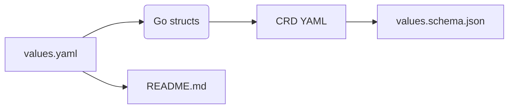

# cozyvalues-gen

Tiny helper that turns **JSDoc-annotated `values.yaml`** files into:

1. **Go structs** – strongly typed, IDE-friendly.
2. **CustomResourceDefinitions (CRD)** – produced by `controller-gen`.
3. **values.schema.json** – OpenAPI schema extracted from the CRD.
4. **README.md** – auto-updated `## Parameters` section.

The chain "_structs → CRD → OpenAPI_" re-uses the same code that Kubernetes itself relies on, so you get **maximum type compatibility** for free.

## Syntax Overview

Uses **JSDoc-like syntax** for clean, readable type annotations:

---

## How it works



- Annotate your `values.yaml` (see [examples](examples) for the exact syntax).
- Run cozyvalues-gen; it parses the comments and spits out Go code.
- controller-gen compiles that code, emitting a CRD.
- The tool trims the CRD down to a Helm-compatible schema.

### Usage (one-liner)

```
cozyvalues-gen \
  --values values.yaml \
  --schema values.schema.json
```

See `cozyvalues-gen` -h for all flags.

## Installation

### Requirements
- **Go toolchain** must be installed and accessible via `$PATH`.


### Using `go install`

```console
go install github.com/cozystack/cozyvalues-gen@latest
```

The binary lands in `$(go env GOPATH)/bin` (usually `~/go/bin`). Make sure that directory is on your `$PATH`.

### Download a pre‑built release binary

Head over to [https://github.com/cozystack/cozyvalues-gen/releases](https://github.com/cozystack/cozyvalues-gen/releases), grab the archive for your OS/arch, unpack it somewhere on your `$PATH`.

## Annotation Tags

### @param
Defines a top-level parameter:
```yaml
## @param {type} name - description
## @param {string} hostname - Server hostname
hostname: "example.com"

## @param {int} replicas - Number of replicas
replicas: 3
```

### @typedef
Defines a custom type (struct):
```yaml
## @typedef {struct} Database - Database configuration
## @field {string} host - Database host
## @field {int} port - Database port

## @param {Database} database - Database config
database:
  host: localhost
  port: 5432
```

### @field / @property
Defines fields within a typedef (@property is a synonym):
```yaml
## @typedef {struct} User
## @field {string} name - User name
## @field {string} [email] - Email (optional, with omitempty)
## @field {int} age=18 - Age with default value
```

### @enum
Defines an enumeration type:
```yaml
## @enum {string} Size - Size preset
## @value small
## @value medium
## @value large

## @param {Size} size="medium" - Selected size
size: "medium"
```

### Special Syntax

- **Optional fields**: `[fieldName]` adds `omitempty` to JSON tag
- **Pointers**: `{*type}` or `{?type}` (equivalent)
- **Default values**: `fieldName=value` or `fieldName="value"`

## Supported value types

| Annotation token               | Go type                                    | JSON Schema             | Examples                             |
| ------------------------------ | ------------------------------------------ | ----------------------- | ------------------------------------ |
| `string`                       | `string`                                   | string                  | `"hello"`                            |
| `bool`                         | `bool`                                     | boolean                 | `true`                               |
| `int`, `int32`, `int64`        | matching signed integer                    | number                  | `42`                                 |
| `float32`, `float64`           | matching float                             | number                  | `3.14`                               |
| `quantity`                     | `resource.Quantity`                        | string                  | `"500Mi"`, `"100m"`, `"4Gi"`         |
| `duration`                     | `metav1.Duration`                          | string                  | `"5m"`, `"1h30m"`                    |
| `time`                         | `metav1.Time`                              | string (RFC 3339)       | `"2025-08-07T12:00:00Z"`             |
| `object`                       | `k8sRuntime.RawExtension`                  | any JSON/YAML           | `{"aaa": 123, "foo": "bar"}`         |
| `emptyobject`                  | empty struct (`struct{}`) **–** no fields  | `{}`                    | `{}`                                 |
| `*<primitive>`                 | pointer to that primitive (`nil` allowed)  | primitive or `null`     | `"asd"`, `null` …                    |
| `<CustomType>`                 | generated struct                           | object                  | declared from `@field` annotations   |
| `*<CustomType>`                | pointer to generated struct                | object or `null`        | `null`                               |
| `[]<T>`                        | slice / YAML sequence                      | list                    | `[]string`, `[]*int`, `[]CustomType` |
| `map[string]<T>`               | map / YAML mapping                         | object                  | keys are always **strings**          |

### String-format aliases

These tokens map to a plain `string` field, **plus** `format: "<alias>"` in the OpenAPI schema:

| `format`        | Example value                          |
| --------------- | -------------------------------------- |
| `bsonobjectid`  | `507f1f77bcf86cd799439011`             |
| `uri`           | `https://grafana.example.com`          |
| `email`         | `user@example.com`                     |
| `hostname`      | `db.internal`                          |
| `ipv4`          | `192.168.0.10`                         |
| `ipv6`          | `2001:db8::1`                          |
| `cidr`          | `10.0.0.0/24`                          |
| `mac`           | `00:1A:2B:3C:4D:5E`                    |
| `uuid`, `uuid3`, `uuid4`, `uuid5` | `550e8400-e29b-41d4-a716-446655440000` |
| `isbn`, `isbn10`, `isbn13`        | `9783161484100`      |
| `creditcard`    | `4242 4242 4242 4242`                  |
| `ssn`           | `123-45-6789`                          |
| `hexcolor`      | `#ff8800`                              |
| `rgbcolor`      | `rgb(255,136,0)`                       |
| `byte`          | `SGVsbG8=` (base64)                    |
| `password`      | *(hidden by most UIs)*                 |
| `date`          | `2025-08-07`                           |

> **Tip:** use any alias exactly like a regular type, e.g.  
> ```yaml
> ## @param apiURL {uri} External URL of the API
> apiURL: ""
> ```

---

Created for the Cozystack project. 🚀
