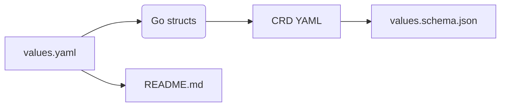

# cozyvalues-gen

Tiny helper that turns **comment-annotated `values.yaml`** files into:

1. **Go structs** – strongly typed, IDE-friendly.
2. **CustomResourceDefinitions (CRD)** – produced by `controller-gen`.
3. **values.schema.json** – OpenAPI schema extracted from the CRD.
4. **README.md** – auto-updated `## Parameters` section.

The chain “_structs → CRD → OpenAPI_” re-uses the same code that Kubernetes itself relies on, so you get **maximum type compatibility** for free.

---

## How it works



- Annotate your `values.yaml` (see [examples](examples) for the exact syntax).
- Run cozyvalues-gen; it parses the comments and spits out Go code.
- controller-gen compiles that code, emitting a CRD.
- The tool trims the CRD down to a Helm-compatible schema.

Usage (one-liner)

```
cozyvalues-gen \
  --values values.yaml \
  --schema values.schema.json
```

See `cozyvalues-gen` -h for all flags.

Created for the Cozystack project. 🚀
